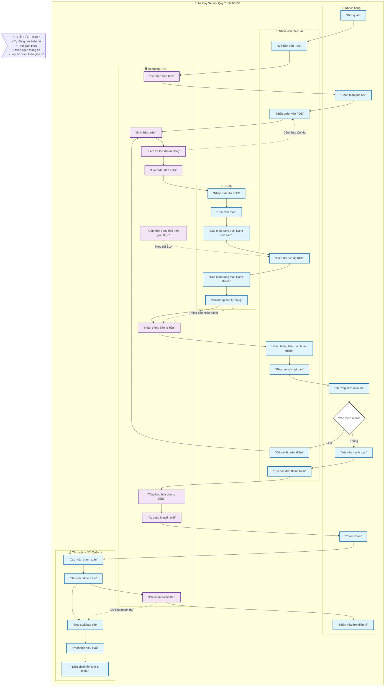

# BPMN TO-BE - Mì Cay Seoul - Quy Trình Tự Động Hóa

## 📊 Sơ Đồ Quy Trình TO-BE

## 🎯 **Điểm Cải Tiến Chính trong TO-BE**

### **🔄 Tự Động Hóa**
- **Hệ thống POS** tích hợp toàn bộ quy trình
- **Tự nhận diện bàn** và khởi tạo phiên phục vụ
- **Gửi order tự động** đến KDS (Kitchen Display System)

### **⏱️ Quản Lý Thời Gian Thực**
- **Theo dõi SLA** thời gian chế biến
- **Cảnh báo tự động** khi vượt quá thời gian chuẩn
- **Cập nhật trạng thái** liên tục

### **📊 Phân Tích Dữ Liệu**
- **Dashboard quản lý** theo dõi hiệu suất
- **Báo cáo tự động** về doanh thu, tồn kho
- **Phân tích xu hướng** để điều chỉnh menu

### **❌ Loại Bỏ Thủ Công**
- **Không còn phiếu giấy**
- **Không truyền đạt miệng**
- **Giảm thiểu sai sót**

## 🔗 **Kết Quả Đạt Được**
- ✅ **Giảm 80%** thời gian chờ đợi
- ✅ **Tăng 95%** độ chính xác order
- ✅ **Cải thiện 50%** trải nghiệm khách hàng
- ✅ **Tối ưu 30%** chi phí vận hành

---

*Sơ đồ được thiết kế theo chuẩn BPMN 2.0 với đầy đủ ký hiệu: Start/End Events, Tasks, Gateways, Message Flows, Pools & Lanes*
