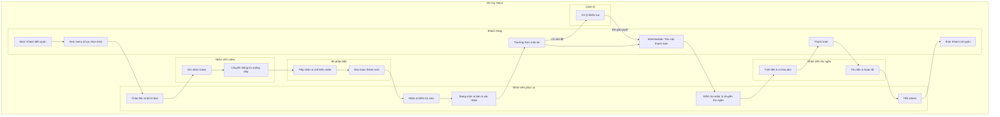

# Sơ đồ BPMN AS-IS - Mì Cay Seoul

```mermaid
flowchart TD
    %% Pool và Lanes
    subgraph Pool [Mì Cay Seoul]
        subgraph Lane1 [Khách hàng]
            A1[Start: Khách đến quán]
            A2[Xem menu & lựa chọn món]
            A3[Thưởng thức món ăn]
            A4[Intermediate: Yêu cầu thanh toán]
            A5[Thanh toán]
            A6[End: Khách rời quán]
        end

        subgraph Lane2 [Nhân viên phục vụ]
            B1[Chào đón & bố trí bàn]
            B2[Nhận & kiểm tra món]
            B3[Mang món ra bàn & xác nhận]
            B4[Kiểm tra order & chuyển thu ngân]
            B5[Tiễn khách]
        end

        subgraph Lane3 [Nhân viên order]
            C1[Ghi nhận Order]
            C2[Chuyển thông tin xuống bếp]
        end

        subgraph Lane4 [Bộ phận bếp]
            D1[Tiếp nhận & chế biến order]
            D2[Báo hoàn thành món]
        end

        subgraph Lane5 [Nhân viên thu ngân]
            E1[Tính tiền & in hóa đơn]
            E2[Thu tiền & hoàn tất]
        end

        subgraph Lane6 [Quản lý]
            F1[Xử lý khiếu nại]
        end
    end

    %% Luồng chính
    A1 --> A2
    A2 --> B1
    B1 --> C1
    C1 --> C2
    C2 --> D1
    D1 --> D2
    D2 --> B2
    B2 --> B3
    B3 --> A3
    A3 --> A4
    A4 --> B4
    B4 --> E1
    E1 --> A5
    A5 --> E2
    E2 --> B5
    B5 --> A6

    %% Luồng xử lý khiếu nại
    A3 -->|Có vấn đề| F1
    F1 -->|Đã giải quyết| A4
```
